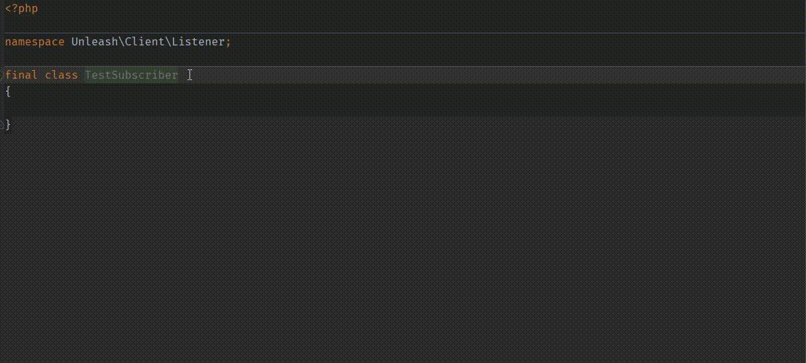

# Event system in Unleash PHP SDK

This SDK supports events using [`symfony/event-dispatcher`](https://packagist.org/packages/symfony/event-dispatcher).

## Installation

The event dispatcher is not a mandatory component of this SDK, so you need to install it by running:

`composer require symfony/event-dispatcher`

## Usage

You can add event subscribers to the builder object:

```php
<?php

use Symfony\Component\EventDispatcher\EventSubscriberInterface;
use Unleash\Client\Event\FeatureToggleDisabledEvent;
use Unleash\Client\Event\FeatureToggleMissingStrategyHandlerEvent;
use Unleash\Client\Event\FeatureToggleNotFoundEvent;
use Unleash\Client\Event\FeatureVariantBeforeFallbackReturnedEvent;
use Unleash\Client\UnleashBuilder;
use Unleash\Client\Event\UnleashEvents;

class MyEventSubscriber implements EventSubscriberInterface
{
    public static function getSubscribedEvents(): array
    {
        return [
            UnleashEvents::FEATURE_TOGGLE_DISABLED => 'onFeatureDisabled',
            UnleashEvents::FEATURE_TOGGLE_MISSING_STRATEGY_HANDLER => 'onNoStrategyHandler',
            UnleashEvents::FEATURE_TOGGLE_NOT_FOUND => 'onFeatureNotFound',
            UnleashEvents::FEATURE_VARIANT_BEFORE_FALLBACK_RETURNED => 'onVariantNotFound',
        ];
    }
    
    public function onFeatureDisabled(FeatureToggleDisabledEvent $event)
    {
        // todo
    }
    
    public function onNoStrategyHandler(FeatureToggleMissingStrategyHandlerEvent $event)
    {
        // todo
    }
    
    public function onFeatureNotFound(FeatureToggleNotFoundEvent $event)
    {
        // todo
    }
    
    public function onVariantNotFound(FeatureVariantBeforeFallbackReturnedEvent $event)
    {
        // todo
    }
}

$unleash = UnleashBuilder::create()
    ->withAppName('My App')
    ->withAppUrl('http://localhost:4242')
    ->withInstanceId('test')
    ->withEventSubscriber(new MyEventSubscriber())
    ->build();

$unleash->isEnabled('test');
```

The relevant methods will be called in the above example when their respective event occurs.

### List of events:

- `\Unleash\Client\Event\UnleashEvents::FEATURE_TOGGLE_NOT_FOUND` - when a feature with the name isn't found on the
  unleash server (or in the bootstrap if it's used). Event object: `Unleash\Client\Event\FeatureToggleNotFoundEvent`
- `\Unleash\Client\Event\UnleashEvents::FEATURE_TOGGLE_DISABLED` - when a feature is found but it's disabled.
  Event object: Unleash\Client\Event\FeatureToggleDisabledEvent
- `\Unleash\Client\Event\UnleashEvents::FEATURE_TOGGLE_MISSING_STRATEGY_HANDLER` - when there is no suitable strategy handler
  implemented for any of the feature's strategies. Event object: `Unleash\Client\Event\FeatureToggleMissingStrategyHandlerEvent`
- `\Unleash\Client\Event\UnleashEvents::FEATURE_VARIANT_BEFORE_FALLBACK_RETURNED` - triggered before the fallback variant
  would be returned in the `getVariant()` call. Event object: `Unleash\Client\Event\FeatureVariantBeforeFallbackReturnedEvent`

## FEATURE_TOGGLE_NOT_FOUND event

You can set a feature that will be evaluated further or set a default value that will be returned.

Example:

```php
<?php

use Symfony\Component\EventDispatcher\EventSubscriberInterface;
use Unleash\Client\Event\FeatureToggleNotFoundEvent;
use Unleash\Client\Event\UnleashEvents;
use Unleash\Client\DTO\DefaultFeature;
use Unleash\Client\UnleashBuilder;

final class MyEventSubscriber implements EventSubscriberInterface
{
    public static function getSubscribedEvents()
    {
        return [
            UnleashEvents::FEATURE_TOGGLE_NOT_FOUND => 'onNotFound',
        ];
    }
    
    public function onNotFound(FeatureToggleNotFoundEvent $event): void
    {
        if ($event->getFeatureName() === 'someFeature') {
            // the call to Unleash::isEnabled() will return true
            $event->setEnabled(true);
        }
        
        if ($event->getFeatureName() === 'someOtherFeature') {
            $feature = new DefaultFeature(name: 'someExistingFeature', enabled: true);
            // the call to Unleash::isEnabled() will continue as if this feature was found
            $event->setFeature($feature);
        }
        
        if ($event->getContext()->getIpAddress() === '127.0.0.1') {
            $event->setEnabled(true);
        }
    }
}

$unleash = UnleashBuilder::create()
    ->withEventSubscriber(new MyEventSubscriber())
    ->build();

$unleash->isEnabled('someFeature'); // true
$unleash->isEnabled('someOtherFeature'); // true, assuming the strategies for 'someExistingFeature' evaluate to true
```

## FEATURE_TOGGLE_DISABLED event

You can set a different feature that will be evaluated afterwards.

Example:

```php
<?php

use Symfony\Component\EventDispatcher\EventSubscriberInterface;
use Unleash\Client\Event\FeatureToggleDisabledEvent;
use Unleash\Client\Event\UnleashEvents;
use Unleash\Client\DTO\DefaultFeature;
use Unleash\Client\DTO\DefaultStrategy;

final class MyEventSubscriber implements EventSubscriberInterface
{
    public static function getSubscribedEvents()
    {
        return [
            UnleashEvents::FEATURE_TOGGLE_DISABLED => 'onFeatureDisabled',
        ];
    }
    
    public function onFeatureDisabled(FeatureToggleDisabledEvent $event): void
    {
        $feature = $event->getFeature();
        if ($feature->getName() === 'someFeature') {
            $feature = new DefaultFeature('someFeature', true, [
                new DefaultStrategy('default'),
            ]);
            $event->setFeature($feature);
        }
    }
}
```

## FEATURE_TOGGLE_MISSING_STRATEGY_HANDLER event

Triggered when no strategy handler can be found for any of the strategies.

Example:

```php
<?php

use Symfony\Component\EventDispatcher\EventSubscriberInterface;
use Unleash\Client\Event\UnleashEvents;
use Unleash\Client\UnleashBuilder;
use Unleash\Client\Event\FeatureToggleMissingStrategyHandlerEvent;
use Unleash\Client\Strategy\DefaultStrategyHandler;

final class MyEventSubscriber implements EventSubscriberInterface
{
    public static function getSubscribedEvents()
    {
        return [
            UnleashEvents::FEATURE_TOGGLE_MISSING_STRATEGY_HANDLER => 'onMissingStrategyHandler',
        ];
    }
    
    public function onMissingStrategyHandler(FeatureToggleMissingStrategyHandlerEvent $event): void
    {
        $context = $event->getContext();
        $feature = $event->getFeature();
        // todo log the failure
        
        $event->setStrategyHandler(new DefaultStrategyHandler());
    }
}
```

## FEATURE_VARIANT_BEFORE_FALLBACK_RETURNED event

Triggered before the fallback variant would be returned. You can set a different fallback variant.

```php
<?php

use Symfony\Component\EventDispatcher\EventSubscriberInterface;
use Unleash\Client\Event\UnleashEvents;
use Unleash\Client\Event\FeatureVariantBeforeFallbackReturnedEvent;
use Unleash\Client\DTO\DefaultVariant;
use Unleash\Client\Enum\Stickiness;
use Unleash\Client\DTO\DefaultVariantPayload;
use Unleash\Client\Enum\VariantPayloadType;
use Unleash\Client\DTO\DefaultVariantOverride;

final class MyEventSubscriber implements EventSubscriberInterface
{
    public static function getSubscribedEvents()
    {
        return [
            UnleashEvents::FEATURE_VARIANT_BEFORE_FALLBACK_RETURNED => 'beforeFallbackVariant',
        ];
    }

    public function beforeFallbackVariant(FeatureVariantBeforeFallbackReturnedEvent $event): void
    {
        $feature = $event->getFeature();
        if ($feature === null) {
            // the fallback would be returned because the feature does not exist
            $featureName = $event->getFeatureName();
            // todo log this
            return;
        }
        $context = $event->getContext();
        $originalFallbackVariant = $event->getFallbackVariant();
        
        $newFallbackVariant = new DefaultVariant(
            name: 'someVariant',
            enabled: true,
            weight: 100,
            stickiness: Stickiness::DEFAULT,
            payload: new DefaultVariantPayload(
                type: VariantPayloadType::STRING,
                value: 'someValue',
            ),
            overrides: [
                new DefaultVariantOverride(field: 'someField', values: ['someValue']),
            ],
        );
        $event->setFallbackVariant($newFallbackVariant);
    }
}
```

## Customizing event dispatcher

If you already use event dispatcher in your app, you can provide it to the builder:

```php
<?php

use Symfony\Component\EventDispatcher\EventDispatcher;
use Unleash\Client\UnleashBuilder;

$eventDispatcher = new EventDispatcher();

// do something with event dispatcher

$unleash = UnleashBuilder::create()
    ->withEventDispatcher($eventDispatcher)
    // add other unleash configurations
    ->build();
```

All event subscribers/listeners registered directly in the event dispatcher work as usual:

```php
<?php

use Symfony\Component\EventDispatcher\EventDispatcher;
use Unleash\Client\UnleashBuilder;
use Unleash\Client\Event\UnleashEvents;
use Unleash\Client\Event\FeatureToggleDisabledEvent;

$eventDispatcher = new EventDispatcher();

$eventDispatcher->addSubscriber(new MyEventSubscriber());
$eventDispatcher->addListener(UnleashEvents::FEATURE_TOGGLE_DISABLED, function (FeatureToggleDisabledEvent $event) {
    // todo
});


$unleash = UnleashBuilder::create()
    ->withEventDispatcher($eventDispatcher)
    // add other unleash configurations
    ->build();
```

> Tip for PhpStorm users: Use the [Symfony plugin](https://plugins.jetbrains.com/plugin/7219-symfony-support)
> for help with autocompletion of events, afterwards it looks like this:



